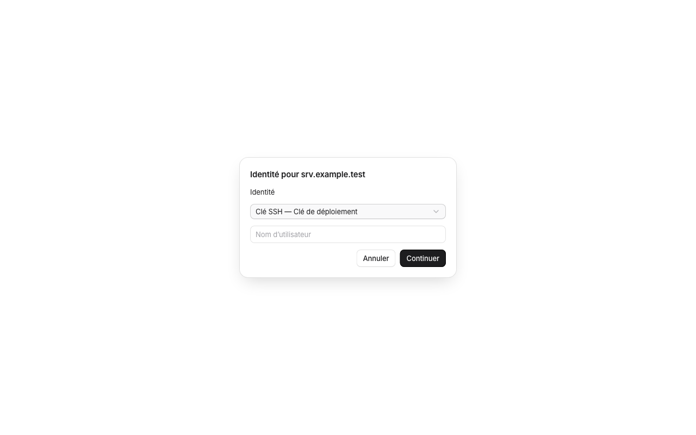

# Unified authentication selection

The original connection prompt accepted text only. Quick-connect plans contained no vault credential, and neither the prompt answer nor the SSH flow could select one. Separately, host username, key and password fields could override a selected identity.

`pnpm exec vitest run src/components/workbench/PromptSecret.test.ts` reproduced the missing selector before the fix (`expected false to be true`). The regression now covers the selector, key and identity answers, combined username/password entry, and separate passphrase prompts.

The native tests use an in-memory vault and a local SSH server. They verify key selection, reconnection using the saved key, switching from a rejected password to an identity with another username, cancellation without saving a host, and avoiding persistence of a rejected password. Vault tests also cover explicit host credentials versus inherited group credentials.

A selected identity now supplies its username and credentials together. Old separate secrets remain stored until an explicit replacement; they do not override a selected identity. The new `ownCredentials` flag defaults to false when reading older records.

The screenshot uses synthetic data. The component was exercised in the collaborative browser, including keyboard selection. Temporary preview files were removed. Private keys remain in the native vault; the selector sends only a key or identity ID.
